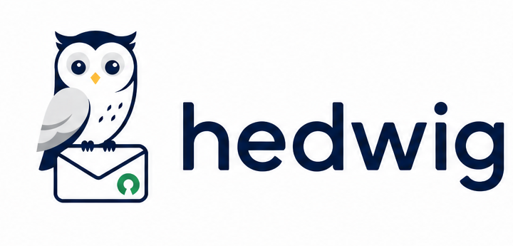

<p align="center">
  
</p>

# hedwig-mail

Self-hostable broadcast email tool. Manage contact lists, design emails with a visual editor, send campaigns through Resend or Amazon SES, and track opens and clicks. No third-party email marketing platform required.

> Sponsored by [Autter](https://autter.dev). Built and maintained as an open source project for the community.
>
> <a href="https://autter.dev"><picture><source media="(prefers-color-scheme: dark)" srcset="https://autter.dev/wordmark-light.png"></picture></a>

## Features

- **Contact Management** - Import contacts via CSV/XLSX upload, organize into lists, track subscription status
- **Visual Email Editor** - Drag-and-drop block editor with live preview, mobile/desktop toggle, and merge tag support
- **Asset Library** - Upload images and files once, browse and reuse them across campaigns from a central library
- **Saved Templates Library** - Save any campaign as a reusable template, browse with live thumbnail previews, and start new campaigns from any template
- **Multiple Email Providers** - Send through Resend or Amazon SES with encrypted credential storage
- **Campaign Sending** - Queue-based sending via pg-boss, with scheduling, cancellation, and per-provider rate limiting
- **Open and Click Tracking** - Tracking pixel for opens, link wrapping for clicks, per-campaign analytics with charts
- **Unsubscribe Handling** - One-click unsubscribe with List-Unsubscribe header support
- **Double Opt-In** - Per-list toggle that requires new contacts to confirm via emailed link before they receive campaigns
- **Signup Forms** - Build forms in the dashboard, share a hosted page or embed a JS snippet on any site, with optional double opt-in
- **REST API** - Full API with Bearer token auth for programmatic access to lists, contacts, and campaign data
- **Self-Contained** - Postgres for everything (data, queue, migrations). No Redis, no external queue. Optional MinIO/S3 for file uploads
- **Docker Ready** - Single `docker compose up` for local development, production-ready Dockerfile included

## Quick Start with Docker

```bash
git clone https://github.com/your-org/hedwig-mail.git
cd hedwig-mail
cp .env.example .env.local
```

Generate required secrets:

```bash
# Generate NEXTAUTH_SECRET
openssl rand -base64 32

# Generate ENCRYPTION_KEY
openssl rand -hex 32
```

Edit `.env.local` with the generated values, then:

```bash
docker compose up -d
```

This starts the app, worker, Postgres, and MinIO. Open [http://localhost:3000](http://localhost:3000) and log in with the credentials from your `.env.local`.

Run database migrations:

```bash
docker compose exec app node -r tsx/cjs lib/db/migrate.ts
```

## Local Development (without Docker)

### Prerequisites

- Node.js 20+
- PostgreSQL 16+
- MinIO (optional, for file uploads)

### Setup

```bash
# Install dependencies
npm install

# Copy environment file and fill in values
cp .env.example .env.local

# Create the database
createdb emailtool

# Run migrations
npm run db:migrate

# Start the dev server
npm run dev

# In a separate terminal, start the background worker
npm run worker
```

The app runs at [http://localhost:3000](http://localhost:3000).

### MinIO Setup (optional, for CSV/XLSX uploads)

If you want contact file uploads to work locally:

```bash
docker run -d \
  --name minio \
  -p 9000:9000 -p 9001:9001 \
  -e MINIO_ROOT_USER=minioadmin \
  -e MINIO_ROOT_PASSWORD=minioadmin \
  minio/minio server /data --console-address ":9001"
```

Then create the bucket:

```bash
# Using the MinIO console at http://localhost:9001
# Or using the mc CLI:
mc alias set local http://localhost:9000 minioadmin minioadmin
mc mb local/emailtool
```

### Available Scripts

| Command | Description |
|---------|-------------|
| `npm run dev` | Start Next.js dev server |
| `npm run build` | Production build |
| `npm run start` | Start production server |
| `npm run worker` | Start background job worker |
| `npm run db:generate` | Generate Drizzle migration files |
| `npm run db:migrate` | Run database migrations |
| `npm run db:studio` | Open Drizzle Studio (database browser) |
| `npm run lint` | Run ESLint |

## Environment Variables

| Variable | Description | Default |
|----------|-------------|---------|
| `APP_URL` | Public URL of the app (used in email links) | `http://localhost:3000` |
| `APP_NAME` | Name shown in unsubscribe pages | `hedwig-mail` |
| `NEXTAUTH_URL` | NextAuth callback URL | `http://localhost:3000` |
| `NEXTAUTH_SECRET` | JWT signing secret | (required) |
| `ADMIN_EMAIL` | Login email | `admin@example.com` |
| `ADMIN_PASSWORD` | Login password | (required) |
| `DATABASE_URL` | PostgreSQL connection string | (required) |
| `S3_ENDPOINT` | S3-compatible endpoint URL | `http://localhost:9000` |
| `S3_REGION` | S3 region | `us-east-1` |
| `S3_ACCESS_KEY_ID` | S3 access key | (required) |
| `S3_SECRET_ACCESS_KEY` | S3 secret key | (required) |
| `S3_BUCKET` | S3 bucket name | `emailtool` |
| `S3_FORCE_PATH_STYLE` | Use path-style URLs (required for MinIO) | `true` |
| `ENCRYPTION_KEY` | 32-byte hex key for encrypting provider credentials | (required) |
| `WORKER_CONCURRENCY` | Number of concurrent email send jobs | `5` |
| `CONFIRMATION_FROM_EMAIL` | Sender address for double opt-in confirmation emails. Required when any list has double opt-in enabled. Sender name uses `APP_NAME`. | (required if double opt-in is used) |
| `RESEND_WEBHOOK_SECRET` | Resend webhook signing secret (optional) | |

## Email Providers

### Resend

1. Go to Settings > Providers in the dashboard
2. Click "Add Provider", select "Resend"
3. Enter your Resend API key
4. Click "Validate Connection" to verify

### Amazon SES

1. Go to Settings > Providers in the dashboard
2. Click "Add Provider", select "SES"
3. Enter your IAM Access Key ID, Secret Access Key, and region
4. Click "Validate Connection" to verify
5. Make sure your sending domain or email is verified in SES

### Setting Up Webhooks

Webhooks let hedwig-mail track bounces and complaints reported by the email provider.

**Resend:**
1. Go to the Resend dashboard > Webhooks
2. Add a webhook pointing to `https://your-domain.com/api/webhooks/resend`
3. Select the `email.bounced` and `email.complained` events
4. Copy the signing secret to `RESEND_WEBHOOK_SECRET` in your env

**Amazon SES:**
1. In AWS SNS, create a topic
2. Add an HTTPS subscription pointing to `https://your-domain.com/api/webhooks/ses`
3. The endpoint will auto-confirm the subscription
4. In SES, configure a Configuration Set to publish bounce and complaint notifications to the SNS topic

## Double Opt-In

Each list has a per-list double opt-in toggle. When enabled, any new contact added to the list (via the dashboard, CSV upload, or REST API) is created with `status = pending` and immediately receives a confirmation email. The contact is excluded from campaigns until they click the link, after which their status flips to `active`.

**Enabling per list:**
- *On creation:* check "Require double opt-in" in the New List dialog.
- *On an existing list:* open the list detail page and use the "Double opt-in" switch in the header. You can flip it on or off at any time.

**Toggle behavior:**
- Turning it **on** affects new contacts only. Existing `active` contacts are not retroactively flipped to `pending`.
- Turning it **off** affects new contacts only. Existing `pending` contacts stay pending until they confirm or are manually edited.

**Required setup:**
1. Set `CONFIRMATION_FROM_EMAIL` in your env to a verified sender address (e.g. `noreply@yourdomain.com`).
2. Configure at least one email provider and mark it as the default in Settings > Providers. Confirmation emails are sent through the default provider.
3. Make sure `APP_URL` is publicly reachable: the confirmation link in the email points at `APP_URL/confirm/<token>`.

**What the recipient sees:** a minimal page at `/confirm/<token>` showing the list name and email address, with a single "Confirm Subscription" button. After clicking, the page shows a success message and the token is consumed.

**Send-time gating:** campaign sends already filter on `status = active`, so pending contacts are automatically excluded with no extra configuration.

## Signup Forms

Forms turn your lists into something people can self-subscribe to. Each form is tied to a single list. Submissions create a contact in that list, respecting the global suppression list.

### Creating a form

1. Go to **Forms** in the sidebar and click **New Form**.
2. Pick a name and a target list.
3. In the builder, configure fields (email is required, plus any combination of text, checkbox, and select fields), set a success message or a redirect URL, and toggle double opt-in if you want a confirmation step.
4. Save.

### Sharing the form

Each form has two surfaces:

- **Hosted page**: `${APP_URL}/form/<form-id>`. Share the link directly or link from a navigation menu.
- **JS embed snippet**: drop the snippet into any HTML page. The form renders inline and posts back to your hedwig-mail instance.

```html
<script
  src="https://mail.example.com/api/public/forms/FORM_ID/embed.js"
  data-form-id="FORM_ID"
  async
></script>
```

The embed renders the form via DOM injection so it inherits your site's styling. For maximum CSS isolation, add `data-mode="iframe"` and the snippet renders the hosted page inside an iframe instead.

### Double opt-in

When double opt-in is enabled, a submission creates a contact with status `pending` and queues a confirmation email through the chosen provider. The contact is not eligible for campaign sends until they click the link, which transitions them to `active` via `${APP_URL}/confirm/<token>`.

The confirmation email is authored with the same block editor used for campaigns. Use the merge tag `{{confirm_url}}` in a button block. Tracking pixels and the unsubscribe footer are deliberately omitted from confirmation emails, since the contact has not opted in yet.

### Suppression and abuse protection

- Submitted emails are checked against the global suppression list before any contact is created. Suppressed emails get the same success response so the form can't be used to probe membership.
- Each form is rate-limited per source IP.
- A hidden honeypot field rejects bots silently.
- Submissions use `application/x-www-form-urlencoded` so the embed avoids CORS preflights from third-party origins.

## Using AWS S3 Instead of MinIO

For production, switch from MinIO to AWS S3 by changing three variables:

```bash
S3_ENDPOINT=             # Remove this line (uses AWS default)
S3_FORCE_PATH_STYLE=     # Remove this line
S3_ACCESS_KEY_ID=AKIA... # Your AWS access key
S3_SECRET_ACCESS_KEY=... # Your AWS secret key
S3_REGION=us-east-1      # Your bucket's region
S3_BUCKET=your-bucket    # Your S3 bucket name
```

## REST API

All API endpoints are under `/api/v1/` and require a Bearer token. Create API keys in Settings > API Keys.

```bash
curl -H "Authorization: Bearer your-api-key" \
  http://localhost:3000/api/v1/lists
```

All responses use the envelope format: `{ data, meta, error }`.

### Endpoints

| Method | Path | Description |
|--------|------|-------------|
| `GET` | `/api/v1/lists` | List all lists |
| `POST` | `/api/v1/lists` | Create a list |
| `GET` | `/api/v1/lists/:listId/contacts` | List contacts (paginated) |
| `POST` | `/api/v1/lists/:listId/contacts` | Create a contact |
| `POST` | `/api/v1/lists/:listId/contacts/bulk` | Bulk upsert contacts (max 1000) |
| `PUT` | `/api/v1/lists/:listId/contacts/:id` | Update a contact |
| `DELETE` | `/api/v1/lists/:listId/contacts/:id` | Delete a contact |
| `GET` | `/api/v1/campaigns` | List all campaigns |
| `GET` | `/api/v1/campaigns/:id` | Get campaign detail |
| `GET` | `/api/v1/campaigns/:id/stats` | Get campaign analytics |

### Pagination

List endpoints support `page` (default 1) and `limit` (default 50, max 200) query parameters.

```bash
curl -H "Authorization: Bearer your-api-key" \
  "http://localhost:3000/api/v1/lists/LIST_ID/contacts?page=2&limit=100"
```

### Filtering Contacts

The contacts endpoint supports `status` and `search` query parameters:

```bash
# Filter by status
curl -H "Authorization: Bearer ..." \
  "http://localhost:3000/api/v1/lists/LIST_ID/contacts?status=active"

# Search by email
curl -H "Authorization: Bearer ..." \
  "http://localhost:3000/api/v1/lists/LIST_ID/contacts?search=john"
```

### Bulk Import

```bash
curl -X POST \
  -H "Authorization: Bearer your-api-key" \
  -H "Content-Type: application/json" \
  -d '{
    "contacts": [
      { "email": "alice@example.com", "firstName": "Alice" },
      { "email": "bob@example.com", "firstName": "Bob", "metadata": { "company": "Acme" } }
    ]
  }' \
  http://localhost:3000/api/v1/lists/LIST_ID/contacts/bulk
```

## Deployment

### Docker (Recommended)

Build and run with the included Dockerfile:

```bash
docker build -t hedwig-mail .
docker run -p 3000:3000 --env-file .env hedwig-mail
```

Run the worker as a separate container:

```bash
docker run --env-file .env hedwig-mail node -r tsx/cjs worker.ts
```

Run migrations before first start:

```bash
docker run --env-file .env hedwig-mail node -r tsx/cjs lib/db/migrate.ts
```

### Railway

1. Connect your GitHub repository
2. Railway auto-detects the Dockerfile
3. Set all environment variables in the Railway dashboard
4. Add a PostgreSQL plugin and update `DATABASE_URL`
5. For the worker, create a second service from the same repo with start command: `node -r tsx/cjs worker.ts`
6. For S3, use an external service (AWS S3, Cloudflare R2, etc.)

For a full beginner-friendly setup with `web` + `worker` + `postgres` + `minio`, use [RAILWAY_DEPLOYMENT.md](./RAILWAY_DEPLOYMENT.md).

### Render

1. Create a new Web Service from your repository
2. Render auto-detects the Dockerfile
3. Set environment variables in the dashboard
4. Add a Render PostgreSQL database and update `DATABASE_URL`
5. Create a Background Worker service for the worker process with start command: `node -r tsx/cjs worker.ts`

### Fly.io

Create a `fly.toml`:

```toml
app = "hedwig-mail"
primary_region = "iad"

[build]

[http_service]
  internal_port = 3000
  force_https = true

[env]
  NODE_ENV = "production"
  PORT = "3000"
```

```bash
fly launch
fly secrets set DATABASE_URL=... NEXTAUTH_SECRET=... ENCRYPTION_KEY=...
fly deploy
```

For the worker, create a separate Fly app or use a Fly Machine with the worker command.

### Vercel

Vercel can host the Next.js app but has limitations:

- **No persistent worker.** Serverless functions have a max execution time. You cannot run the pg-boss worker on Vercel.
- **Workaround:** Host the worker separately (Railway, Render, a VPS, or a long-running container). The worker only needs `DATABASE_URL` and the same env vars.
- **Serverless function timeout** may affect large campaign sends via the API. Use the worker for all sending.

### Important: APP_URL

Set `APP_URL` to your production domain (e.g., `https://mail.yourdomain.com`). This URL is embedded into tracking pixels and unsubscribe links in sent emails. Do not change it after sending campaigns, or tracking links in already-sent emails will break.

## Architecture

```
Next.js App (port 3000)
  - Dashboard UI (React, Tailwind, shadcn/ui)
  - Internal API routes (/api/internal/*)
  - Public API routes (/api/v1/*)
  - Tracking routes (/t/*, /r/*)
  - Webhook receivers (/api/webhooks/*)

Background Worker (worker.ts)
  - Processes email send jobs from pg-boss queue
  - Handles rate limiting per provider
  - Checks for campaign cancellation

PostgreSQL
  - Application data (lists, contacts, campaigns)
  - Job queue (pg-boss tables)
  - Migrations (Drizzle)

S3/MinIO
  - CSV/XLSX upload storage
```

## Security

Found a vulnerability? Please do not file a public issue. See [SECURITY.md](./SECURITY.md) for the private reporting process.

For operators, the production hardening checklist lives in [SETUP.md](./SETUP.md#production-security-checklist).

## Contributing

Pull requests welcome. See [CONTRIBUTING.md](./CONTRIBUTING.md) for local setup, branch naming, and the PR checklist.

## Sponsor

<a href="https://autter.dev">
  <picture>
    <source media="(prefers-color-scheme: dark)" srcset="https://autter.dev/wordmark-light.png">
    
  </picture>
</a>

hedwig-mail is sponsored by [Autter](https://autter.dev). Autter funds development and maintenance, but the project is open source under MIT and runs entirely on infrastructure you control.

## License

MIT
